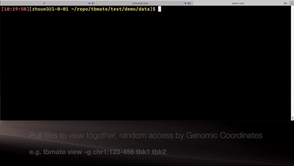
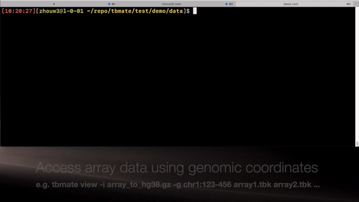
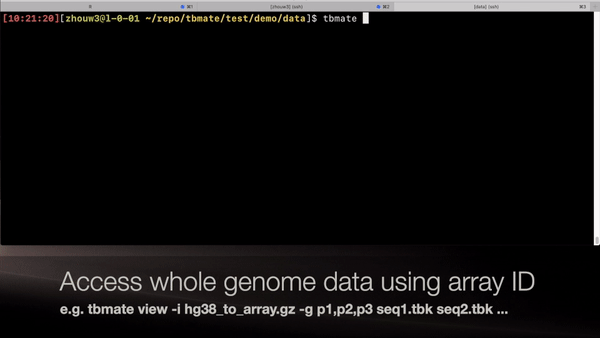
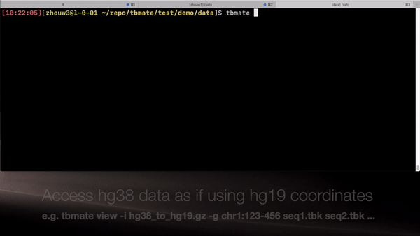

# TabixMate: nimble storage and retrieval of multifarious large-scale genomic data

tbmate (TabixMate) works with [Tabix](http://www.htslib.org/doc/tabix.html) - the Swiss-knife tool for random accessing genomic data. However, there are 3 limitations of applying tabix to large genome-wide data sets.

1. Random access is on a per file basis. Splitting and merging data sets are clumsy.
2. Each tabix-ed file (bed, gff etc) must contain a set of genomic coordinates, which creates redundancy in storage.
3. Data is bound to a coordinate system. Changing coordinate system requires data copy and re-indexing.
4. Addressing is opaque.

tbmate is meant to solve/alleviate these challenges by de-coupling the data from the coordinate system.

1. Random accessing on any group of files packed under the same address set.
2. Coordinates are stored separately from data. Data is (semi-automatically) rebound to coordinates during IO
3. Data addresses can be re-arranged to allow accessing under a different coordinate system. Therefore, the coordinate system can be switched by swapping address file without copying data.
3. Addresses are stored in plain text. Disk offset can be easily calculated.
4. tbmate supports random disk output

tbmate is currently implemented in C and R. It can easily be extended to other programming languages.

## "Column-wise operation" by file selection.

Each sample is stored in a file. Data sets can be easily assembled by selecting files.

Here is an example of Infinium EPIC array, stored and accessed by array ID


Here is another example of Whole Genome Bisulfite Sequencing Data, stored and accessed by genomic coordinates.



## Virtual coordinate switch without copying data.

It is cumbersome to keep another copy of data after changing genome assembly. This can be even more storage consuming when one need to re-format array data to be co-analyzed by genome-wide data. tbmate can read a re-arranged address file so that data is used under the new coordinate system withot actual data re-storage. For example, one can use array data with a genomic coordinate so that it is used as a whole genome data. 

Here is an example to demo projection of array (Infinium EPIC beadchip) to hg38 genomic coordinates. Note the change in index file with `-i`.



Here is another example of using WGBS data as if it's on the array platform. The index projects genomic coordinates to array probe ID:



Here is an example of projecting across genome assemblies (hg38 to hg19):



All index files can be uniquely specified by platform (genome assembly, array ID system etc.) and do not depend on data. Datasets can share one copy through symlinks.

## Usage

### Installation

Download the repo and run `make`. R script is inside the scripts folder.

### Pack into .tbk files

```
tbmate pack -s float input.bed output.tbk
```
input is a bed file that has the same row order as the index file.

Here are the function options:

```
Usage: tbmate pack [options] <in.bed> <out.tbk>

Options:
    -s        int2, int32, int, float, double, ones ([-1,1] up to 3e-5 precision)
    -x        optional output of an index file containing address for each record.
    -h        This help
```

### View .tbk files

```
tbmate view input.tbk [more_input.tbk [...]]
```

`-i index_file` can be provided to specify the index file. It is *crucial* to use the index file compatible with the .tbk file. Here are the options.

```
Usage: tbmate view [options] [.tbk [...]]

Options:
    -o        optional file output
    -i        index, a tabix-ed bed file. Column 4 is the .tbk offset.
              if not given search for idx.gz and idx.gz.tbi in the folder
              containing the first tbk file.
    -g        REGION
    -c        print column name
    -a        print all column in the index
    -d        using dot for negative values
    -p        precision used to print float[3]
    -u        show unaddressed (use -1)
    -R        file listing the regions
```

### The index files

The index file is a tabix-ed bed/bed.gz file. The 4-th column contains the offset in the tbk file. There can be more columns for storing additional information (e.g., the array ID). The index file for data generated on the same coordinate system (the native address file) should just have a trivial enumerating 4-th column, i.e.,

````
chr1    10468   10470   0
chr1    10470   10472   1
chr1    10483   10485   2
chr1    10488   10490   3
chr1    10492   10494   4
chr1    10496   10498   5
````

or if it's array (the 2nd and 3rd columns are not used).

```
cg00000029      1       2       0
cg00000103      1       2       1
cg00000109      1       2       2
cg00000155      1       2       3
cg00000158      1       2       4
cg00000165      1       2       5
```

The cross-coordinate index will have a more scrambled addresses. For example, hg38_to_EPIC.idx.gz has

```
cg00000029   1   2   9719014    chr16:53434199-53434201
cg00000103   1   2   19704158   chr4:72604468-72604470
cg00000109   1   2   18796088   chr3:172198246-172198248
cg00000155   1   2   23714121   chr7:2550930-2550932
cg00000158   1   2   27254375   chr9:92248272-92248274
```

and EPIC_to_hg38.idx.gz has

```
chr1   10468   10470   -1   .
chr1   10470   10472   -1   .
chr1   10483   10485   -1   .
...
chr1    69590   69592   699401  cg21870274
...
```

Note most entries have -1s which indicate no Infinium EPIC array ID is spotted. `tbmate view -d` can optionally omit these in the display. All index files can be easily generated from the native address file.

### The tbk files

tbk file is a binary file. The first three bytes have to be "tbk" and will be validated by tbmate. The first 512 bytes store the data header:

1. 3 bytes: "tbk"
2. 4 bytes: version, currently 1
3. 4 bytes: data type, enum {NA, INT2, INT32, FLOAT, DOUBLE, ONES}
4. 8 bytes: number of values in the data
5. 493 bytes: extra space, currently used for message

```
tbmate header input.tbk
```

The header subcommand will output the header inforamtion

Currently tbmate supports the following data types
1. INT2: 2 bits
2. INT32: 4 bytes
3. FLOAT: 4 bytes
4. DOUBLE: 8 bytes
5. ONES: 2 bytes, low precision (3e-5) storage for [-1,1] real number.
